# 外卖平台

**食用方法：**

- **使用QT creator打开waimai.pro文件**

- **进行构建**

- **将数据文件复制到构建的文件夹中替换自动生成的数据库。由于程序中未写所必须的生成表语句，修改数据库文件时注意保留users表和store表。**

### 1.需求分析：

设计一个外卖平台，包含B端和C端。

B端商家登录外卖平台，需求设置个人店铺信息、菜单信息、查看顾客的订单、查看店铺营收。

C端顾客登录外卖平台，需求选择店铺、进入店铺后进行选餐、选餐后生成订单。

### 2.实现功能：

| 功能模块                   | 主要功能 | 描述                                                         |
| -------------------------- | ------------ | ------------------------------------------------------------ |
| 登录界面                   | 登录     | 输入用户名、密码登录判断是否已注册并且密码输入正确，并对用户弹出提示 |
|                            |          | 判断该用户名是商家还是顾客                                   |
|                            |          | 密码仅可输入数字                                             |
|                            |          | 密码可调整是否可见                                           |
|                            | 注册     | 跳转到注册页面                                               |
|                            | 进入     | 可根据用户名类型进入商家或顾客主页面                         |
| 注册页面                   | 注册     | 输入用户名、密码、确认密码并判断是否已注册并且密码和确认密码输入一致，并对用户弹出提示 |
|                            |          | 选择为商家账号还是顾客账号，选择为商家账号时跳出输入店铺名的文本框 |
|                            |          | 密码仅可输入数字                                             |
|                            |          | 密码可调整是否可见                                           |
|                            | 返回     | 可返回登录界面                                               |
| 顾客主页面（选择店铺页面） | 展示店铺 | 动态展示入驻平台的所有商家账号名下的店铺                     |
|                            |          | 显示店铺名、人均价格、评分、地址                             |
|                            |          | 子模块竖直排布，超出范围可自动添加滚动条                     |
|                            | 进入     | 可点击店铺进入店铺                                           |
|                            | 返回     | 可退出登录返回登录界面                                       |
| 顾客选餐页面               | 展示菜品  | 动态展示商家添加的菜单，每个菜品为一个子模块，显示菜品名称、单价、简要介绍 |
|                            |          | 子模块竖直排布，超出范围可自动添加滚动条                     |
|                            | 选择菜品  | 菜品数量提供一个QSpinBox进行选择，仅为整数                   |
|                            |          | 选好的菜品的总价实时显示在控件上，即上面QSpinBox内的数量发生改变时便会发出信号来让计算总价 |
|                            | 进入     | 选择好菜品后可选择进入付款界面                               |
|                            | 返回     | 可返回店铺选择界面                                           |
| 付款界面                   | 展示     | 展示已选择的菜品来生成账单                                   |
|                            |          | 账单包括菜品名、数量、单个菜品总价、全部菜品总价和随机生成的配送费 |
|                            |          | 展示付款码（伪）                                             |
|                            | 进入     | 点击确认付款认定为付款完成，订单数据同步进数据库。           |
|                            |          | 然后程序会返回到店铺选择页面，可重新再次进行选餐             |
|                            |          | 同一顾客在同一店铺重复点单，订单会累加计入                   |
|                            | 返回     | 若不想付款可返回选餐页面，订单不会计入数据库                 |
| 商家主页面                 | 进入     | 可进入个人中心、菜单管理、订单管理、营收查看页面             |
|                            | 显示     | 可显示当前店铺店铺名于界面上方，表明当前所管理的店铺         |
|                            | 返回     | 可退出登录返回登录页面                                       |
| 个人中心页面               | 查看     | 可查看当前店铺名、地址、图片（未设置图片会有默认图片）       |
|                            | 修改     | 可修改当前店铺名、地址、图片                                 |
|                            | 返回     | 可手动返回商家主页面                                         |
|                            |          | 修改完个人数据后页面需要更新，因此会自动返回登录界面，需要重新登录 |
| 菜单管理页面               | 查看     | 通过表格查看当前店铺的菜单数据                               |
|                            | 修改     | 可实现对菜单的增删改，并实时更新到表格中                     |
|                            | 返回     | 可手动返回商家主页面                                         |
| 订单管理界面               | 查看     | 可动态显示顾客的订单，按顾客用户名分为各个子模块             |
|                            | 进入     | 可完成订单，数据将进入店铺的总售出，用于计算店铺营收         |
|                            | 返回     | 可返回商家主页面                                             |
| 营收查看界面               | 查看     | 借助商家的总售出，计算总营收并展示                           |
|                            |          | 利用柱状图将各个菜品的营收展示，便于商家分析市场喜好         |
|                            | 返回     | 可返回商家主页面                                             |

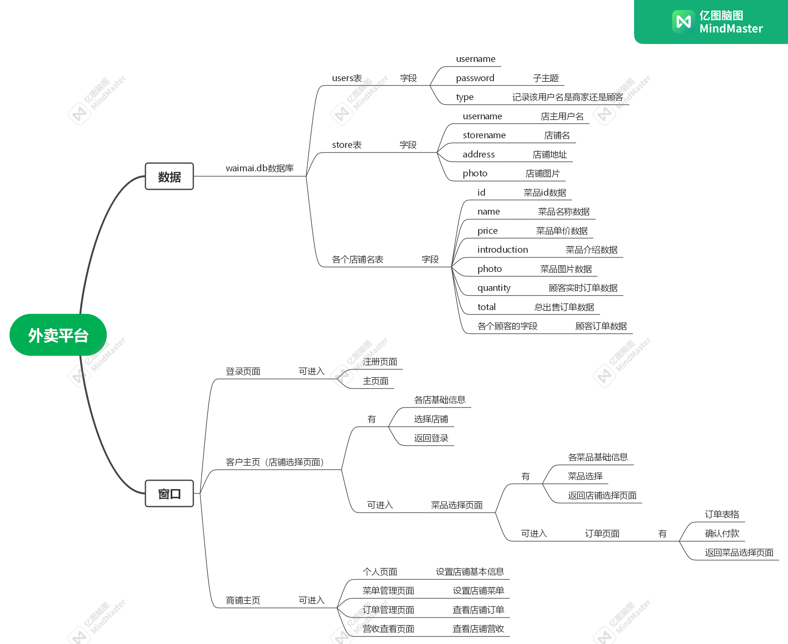

### 3.未实现功能

- 评分系统
- 商家出餐后用户的收餐页面

### 4.自定义类

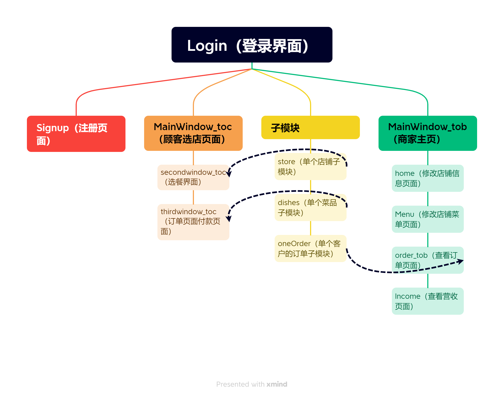

#### 4.1.各类展示

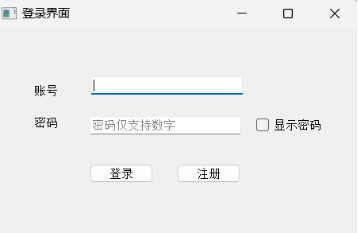

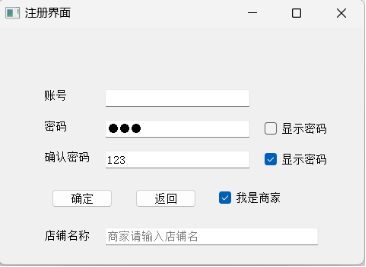

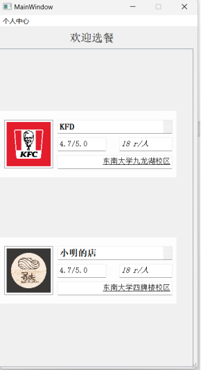

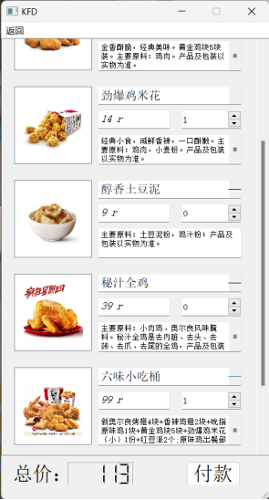

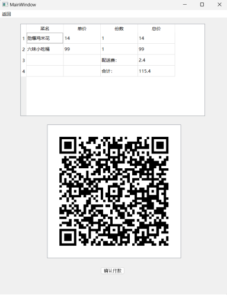

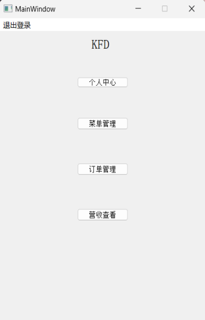

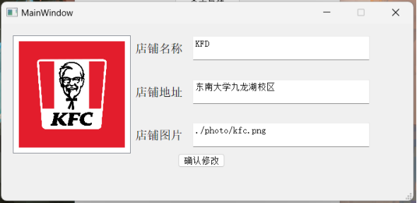

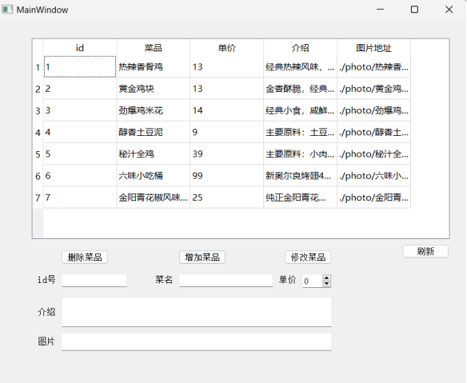

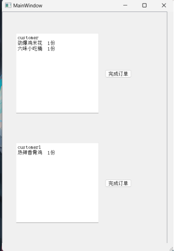

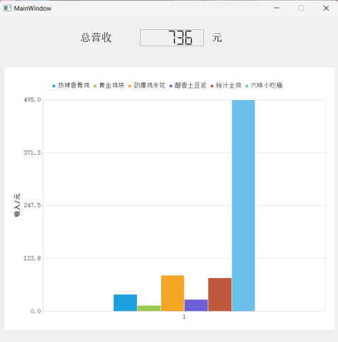

